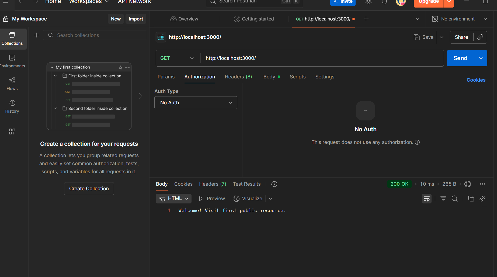
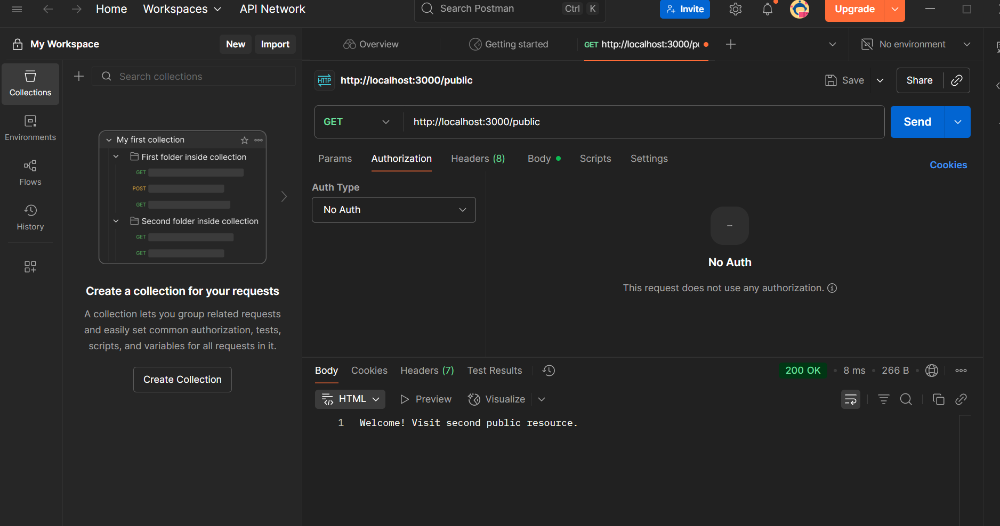
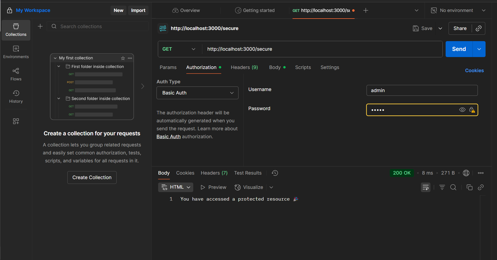
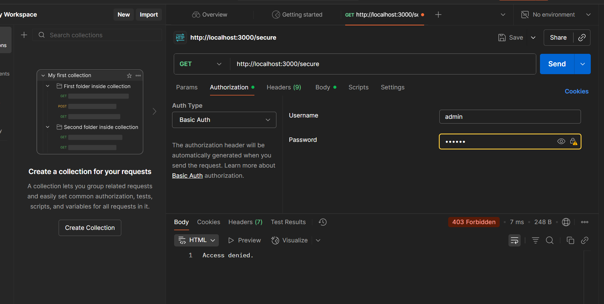
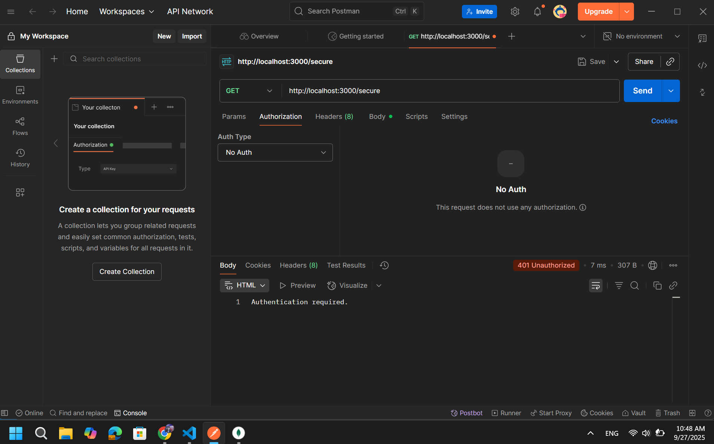

# Simple Authentication Demo
Dự án demo các phương thức xác thực trong Node.js Express, bao gồm Basic Authentication và Cookie-based Authentication.

## Cài đặt

```bash
npm install
```

## Chạy ứng dụng

### Basic Authentication Demo
```bash
node basic_auth.js
```
Server sẽ chạy tại: http://localhost:3000

### Cookie Authentication Demo
```bash
node cookie_auth.js
```
**Lưu ý:** Cần có MongoDB chạy tại localhost:27017

## API Endpoints

### Basic Auth (basic_auth.js)
- `GET /` - Public route
- `GET /public` - Public route
- `GET /secure` - Protected route (cần Basic Auth)
  - Username: `admin`
  - Password: `12345`

### Cookie Auth (cookie_auth.js)
- `POST /login` - Đăng nhập và tạo cookie
- `GET /profile` - Protected route (cần cookie hợp lệ)
- `POST /logout` - Đăng xuất và xóa cookie

## Test với Postman

### 1. Public Route


### 2. Secure Route với Basic Auth

sai user và pass

-Gọi trực tiếp


### 3. Login với Cookie Auth
![Cookie Auth Login]

### 4. Protected Route với Cookie
![Protected Route Cookie]

### 5. Logout
![Logout]

## Thông tin xác thực

